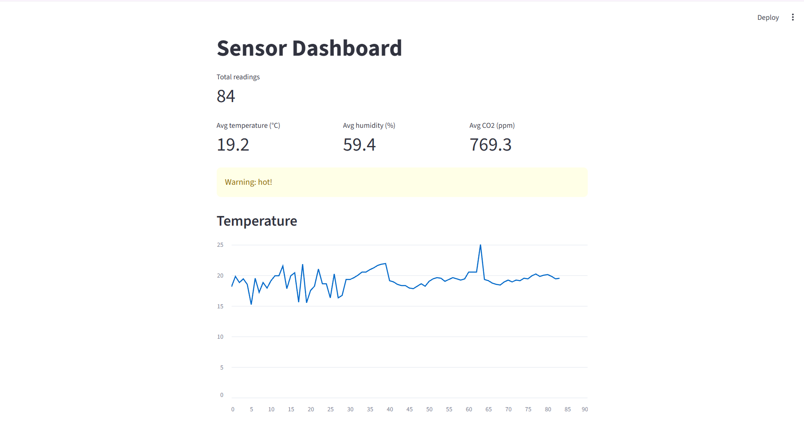

# Sensor Logger

A beginner-friendly Python project that simulates an IoT sensor node. A sender script posts fake temperature, humidity and CO2 readings to a FastAPI server, which stores them in a SQLite database. A Streamlit dashboard shows summary metrics, a high-temperature warning and live charts. It runs with no hardware, as a foundation for later IoT projects where the simulated sensor can be swapped for a real one.



## How it works

The project follows the same pipeline as a real IoT system, just at a small scale. It has two paths: simple scripts that use a CSV file, and an API with a database.

**Path 1: CSV scripts**

1. **Sensor** (`sensor.py`): generates readings and appends them to `readings.csv`. The header row is written only once, even across multiple runs.
2. **Storage** (`readings.csv`): one row per reading with the columns `time`, `temperature`, `humidity` and `co2`.
3. **Analysis** (`analyse.py`): prints the minimum, maximum and average for each measurement, plus a warning if the maximum temperature is above 21 °C.
4. **Visualisation** (`plot.py`): draws temperature and humidity on separate charts and saves them as `chart.png`.

**Path 2: API, database and dashboard**

1. **API sender** (`send_readings.py`): simulates a sensor that sends readings to the server.
2. **API server** (`server.py`): a FastAPI server that receives readings and serves summaries (count, latest, minimum and maximum temperature).
3. **Database** (`db.py`): stores readings in a SQLite database (`sensor.db`).
4. **Dashboard** (`dashboard.py`): reads from the database and shows the averages, a temperature warning and live charts in the browser using Streamlit.

Shared code for reading CSV columns lives in `helpers.py`. `import_csv.py` copies existing readings from `readings.csv` into the database (run it once).

There are 15 automated tests (`test_helpers.py`, `test_db.py`, `test_server.py`).

## How to run

Requires Python 3 and these libraries:

```
pip install matplotlib streamlit fastapi uvicorn requests httpx pytest
```

**Path 1: CSV scripts**

```
python sensor.py     # generate and log readings (run it a few times)
python analyse.py    # print summary statistics
python plot.py       # show the chart and save chart.png
```

`readings.csv` is created by `sensor.py`, so run it first.

**Path 2: API, database and dashboard**

Run each command in its own terminal:

```
python -m uvicorn server:app --reload
python send_readings.py
python -m streamlit run dashboard.py
```

The database file `sensor.db` is created automatically. Optionally, run `python import_csv.py` once to copy your existing CSV readings into it.

**Tests**

```
python -m pytest
```

## What I practised

- Functions, loops, lists and `if/else`
- Reading and writing CSV files
- Splitting code into reusable functions and modules
- Plotting data with matplotlib
- Building a REST API with FastAPI
- Storing data in a SQLite database with SQL
- Building a dashboard with Streamlit
- Writing automated tests with pytest
- Using Git and GitHub from the terminal

## Next steps

- Make the dashboard read from the API instead of the database file
- Replace the fake sensor with a real ESP32 sensor node
- Package the project with Docker and deploy the dashboard online
